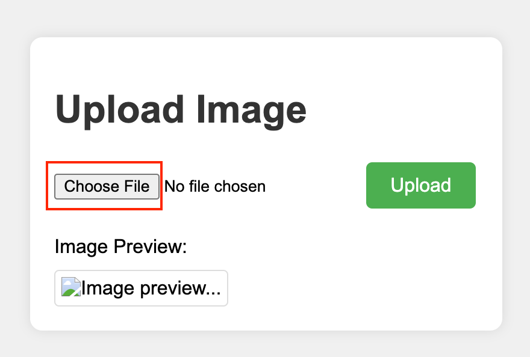
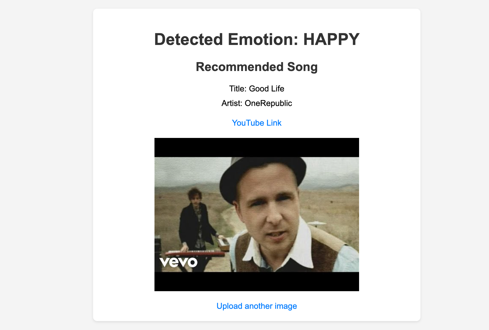

# 👀🎧 표정 인식 기반 노래 추천 서비스

## 프로젝트 멤버

- **강원우** : 프로젝트 기획 및 발표
- **김대욱** : ChatGPT API 연동 및 감정에 따른 노래 추천 로직 구현
- **김주송** : AWS Rekognition API 연동
- **배준석** : 프론트엔드 구현

## 프로젝트 소개

**표정 인식 기반 노래 추천 서비스** 는 사용자의 얼굴 표정을 인식하여 감정을 분석한 후, 해당 감정에 맞는 노래를 추천해주는 웹 서비스입니다.

웹페이지를 통해 사용자의 얼굴 사진을 업로드하면, AWS Rekognition을 이용하여 표정을 분석합니다. 이후 GPT API를 활용해 감정에 맞는 노래를 추천하여 사용자의 기분에 맞는 음악을 즐길 수 있도록 도와줍니다.

주요 기능:

1. **얼굴 표정 인식**: 사용자가 업로드한 사진을 AWS Rekognition으로 분석하여 감정 상태를 파악
2. **노래 추천**: GPT API를 활용하여 분석된 감정에 어울리는 노래를 추천
3. **사용자 맞춤 서비스**: 사용자의 기분에 맞는 노래를 추천하여 감정에 따른 음악 감상 경험 제공

## 프로젝트 필요성

대부분의 음악 스트리밍 서비스는 청취 기록이나 사용자의 명시적인 선호도 입력에 의존합니다. 그러나 이러한 방식은 사용자의 현재 기분을 즉각적으로 반영하지 못할 수 있습니다.

**표정 인식 기반 노래 추천 서비스**는 사용자의 얼굴 표정을 분석하여 즉각적으로 감정을 파악하고, 이에 맞는 음악을 추천합니다. 이를 통해 보다 개인화된 음악 경험을 제공하고, 사용자의 감정 상태에 맞춰 음악을 선택하는 과정을 간소화할 수 있습니다.

### Use-Case

- **상황 1: 직장에서 스트레스를 많이 받아 지친 상태 😠**

  - **결과**: 시스템이 지친 표정을 감지하고, 안정을 주는 음악 또는 차분한 음악을 추천하여 사용자가 휴식을 취할 수 있도록 돕습니다.

- **상황 2️: 시험에서 원하는 결과를 얻어서 기분이 좋은 상태 🥰**

  - **결과**: 시스템이 기쁜 표정을 감지하고, 기쁘고 활기찬 노래를 추천해서, 기쁨이 오래 지속될 수 있게 돕습니다.

- **상황 3️: 목표했던 회사에 들어가지 못해서 상실감을 느끼는 상태 😢**
  - **결과**: 시스템이 슬픈 표정을 감지하고, 위로가 되는 음악 또는 기분을 전환할 수 있는 음악을 추천해서 슬픔을 빨리 극복할 수 있도록 도와줍니다.

## 관련 기술/논문/특허 조사 내용 소개

### 관련 기술 소개

#### 1. ChatGPT API

OpenAI에서 제공하는 대화형 인공지능 서비스로 이 API는 GPT(Generative Pre-trained Transformer) 모델을 기반으로 하며, 사용자의 입력을 이해하고 자연스러운 대화를 생성하는 데 사용된다. ChatGPT API는 챗봇 용도로 활용될 수 있으며 특히, 자연어 처리 능력을 통해 사용자에게 맞춤형 추천이나 정보를 제공해준다.

- [ChatGPT API](https://openai.com/index/introducing-chatgpt-and-whisper-apis/)

#### 2. AWS Rekognition

Amazon Web Services에서 제공하는 이미지 및 비디오 분석 서비스로 얼굴 인식, 감정 분석, 객체 탐지, 텍스트 인식 등 다양한 기능을 제공한다. 이를 통해 사진이나 동영상에서 사람의 얼굴을 인식하고 감정 등을 분석할 수 있다.

- [AWS Rekognition](https://aws.amazon.com/ko/rekognition/)

### 관련 논문 조사

#### 1. 얼굴 표정을 통한 감정 분류 및 음악 재생 프로그램

딥러닝을 활용하여 얼굴 표정을 인식하고 그에 맞는 음악을 재생하는 프로그램을 제안한다. 웹 캠을 통해 사용자의 얼굴 표정을 인식하여 감정을 추측한다. 이후, 해당 감정에 맞는 노래를 재생하여 사용자의 감정이 완화될 수 있도록 도움을 준다.

- [윤경섭, 이상원, "얼굴표정을 통한 감정 분류 및 음악재생 프로그램"](https://scienceon.kisti.re.kr/srch/selectPORSrchArticle.do?cn=NPAP12899870)

#### 2. 딥러닝 감정 인식 기반 배경음악 매칭 설계

멀티모달 감정인식을 통해 사람의 감정을 정확하게 분류하고, 사람의 감정에 어울리는 음악을 매칭하는 시스템을 설계한다.

- [정문식, 문남미,"딥러닝 감정 인식 기반 배경음악 매칭 설계"](https://kiss.kstudy.com/Detail/Ar?key=3921281)

### 관련 서비스 조사

#### 1. 미국 크루즈 기업 Royal Caribbean의 Sound Seeker

사진을 이용해 사용자들에게 맞는 음악을 추천해준다. Sound Seeker 홈페이지에 자신이 좋아하는 취향의 사진 3장을 업로드하면, 사진의 색깔과 배경, 사진에 등장한 사람의 얼굴 표정, 몸짓에서 드러나는 감정 등을 분석하여 어울리는 음악을 추천해준다.

- [Sound Seeker](https://www.royalcaribbean.com/soundseeker?lang=en)

#### 2. 인공지능 개발 업체 인디제이의 모바일 앱 inDJ(인디제이)

상황을 자동으로 분석하여 맞춤형 음악 플레이리스트를 추천해준다. 특허 받은 AI를 기반으로 사용자 프로파일과 상황, 감정을 분석해 3D 모델링 기법으로 음악을 선별해준다.

- [inDJ](https://www.indj.ai/)

#### 3. 스포티파이(Spotify)

사용자의 음성을 활용해 콘텐츠를 추천해준다. 사용자의 음성을 통해 연령과 성별, 음조나 억양, 리듬을 AI가 분석해 감정 상태를 파악한 후 어울리는 음악을 선별해준다.

- [Spotify](https://open.spotify.com/)

## 프로젝트 개발 결과물

### 시스템 다이어그램


### 상세 설명

1. **Client가 service에 facial data(사진) 전송 및 결과 요청**
   - 사용자는 자신의 얼굴 사진을 service에 전송합니다.
2. **Service는 전달 받은 facial data를 AWS Rekognition에 전송, 표정 분석 요청**
   - 서비스는 얼굴 데이터를 AWS Rekognition에 전달하여 표정을 분석합니다.
3. **AWS Rekognition은 표정을 분석하여 결과 값을 service에 전달**
   - AWS Rekognition은 얼굴 데이터를 분석하여 표정 결과를 서비스에 반환합니다.
4. **Service는 GPT API를 사용, 분석한 표정을 통해 GPT에게 노래 추천 질문 전달**
   - 서비스는 분석된 표정을 바탕으로 GPT API에 적절한 노래를 추천해 달라고 요청합니다.
5. **GPT가 맞는 노래 추천 목록 전달**
   - GPT는 표정에 맞는 노래 목록을 서비스에 전달합니다.
6. **표정 상태 및 노래 추천 목록 결과를 Client에 전달**
   - 서비스는 최종 추천 결과를 사용자에게 반환합니다.

## 개발 결과물 사용 방법

### 설치 방법

1. **[Python](https://www.python.org/downloads/) 설치**

2. **프로그램 실행에 필요한 module 설치**

   - terminal에 아래 내용을 입력한다.
   - `pip install flask boto3 python-dotenv langchain-openai`

3. **/src 폴더 내, .env 파일 생성**

4. **[AWS](https://hyunki99.tistory.com/94) 및 [Open AI 인증키](https://velog.io/@ji1kang/OpenAI%EC%9D%98-API-Key-%EB%B0%9C%EA%B8%89-%EB%B0%9B%EA%B3%A0-%ED%85%8C%EC%8A%A4%ED%8A%B8-%ED%95%98%EA%B8%B0) 발급**

5. **AWS 인증키 발급 후, 권한 정책에서 'AmazonRekognitionFullAccess'를 허용해야 한다.**

6. **.env 파일 내용 추가**

```python
AWS_ACCESS_KEY_ID = {your AWS access key ID}
AWS_SECRET_ACCESS_KEY = {your AWS secret access key}
OPEN_API_KEY= {your Open AI API key}
```

7. **terminal에 `python app.py` 입력하여 실행**

### 동작 방법

1. **'Choose File' 버튼을 클릭하여 사진을 선택한다. (단, 사진의 크기가 5MB 이하여야 한다.)**
<div style="margin-left: 90px;">
   
</div>

2. **'Upload' 버튼을 클릭하여 사진을 업로드한다.**
<div style="margin-left: 90px;">
   
</div>

3. **/uploads/happy.jpeg 를 예시로 넣으면 아래와 같은 Preview를 확인할 수 있다.**

<div style="margin-left: 90px;">
   
</div>

4. **사진에서의 감정을 인식한 결과와 이를 바탕으로 추천하는 노래 제목 및 가수, YouTube Link를 제공한다.
   썸네일을 클릭할 경우, 유튜브로 바로 연결되는 기능도 제공한다.**

<div style="margin-left: 90px;">
   
</div>

## 개발 결과물의 활용 방안

표정 인식 기반 노래 추천 서비스는 다양한 분야에서 활용될 수 있습니다

1. 개인 맞춤형 음악 추천 서비스

   - 감정 인식을 통해 사용자의 현재 기분에 맞는 음악을 제공하여 보다 개인화된 음악 경험을 제공합니다.

2. 감정 기반 컨텐츠 추천

   - 음악 외에도 동영상, 기사, 책 등 다양한 컨텐츠를 감정에 따라 추천할 수 있습니다.

3. 감정 인식 피드백 시스템

   - 실시간 감정 모니터링을 통해 맞춤형 피드백을 제공하고, 사용자 경험을 향상시킬 수 있습니다.

4. 맞춤형 광고

   - 사용자의 감정을 분석하여 타겟팅 광고를 제공함으로써 광고 효과를 극대화할 수 있습니다.

5. 스마트 기기 연동

   - 스마트홈이나 웨어러블 기기와 연동하여 감정 기반의 자동화된 환경 설정을 구현할 수 있습니다.

6. 엔터프라이즈 솔루션

   - 기업 내에서 감정 분석을 통해 직원 복지와 업무 효율성을 향상시킬 수 있습니다.

7. 감정 분석 리서치
   - 대규모 감정 데이터를 분석하여 심리 연구 및 마케팅 리서치에 활용할 수 있습니다.

이 외에도, 감정 인식 기술을 다양한 산업과 서비스에 접목하여 새로운 사용자 경험을 창출할 수 있습니다.

[def]: rc/readme_photo/uploadImage.pn
